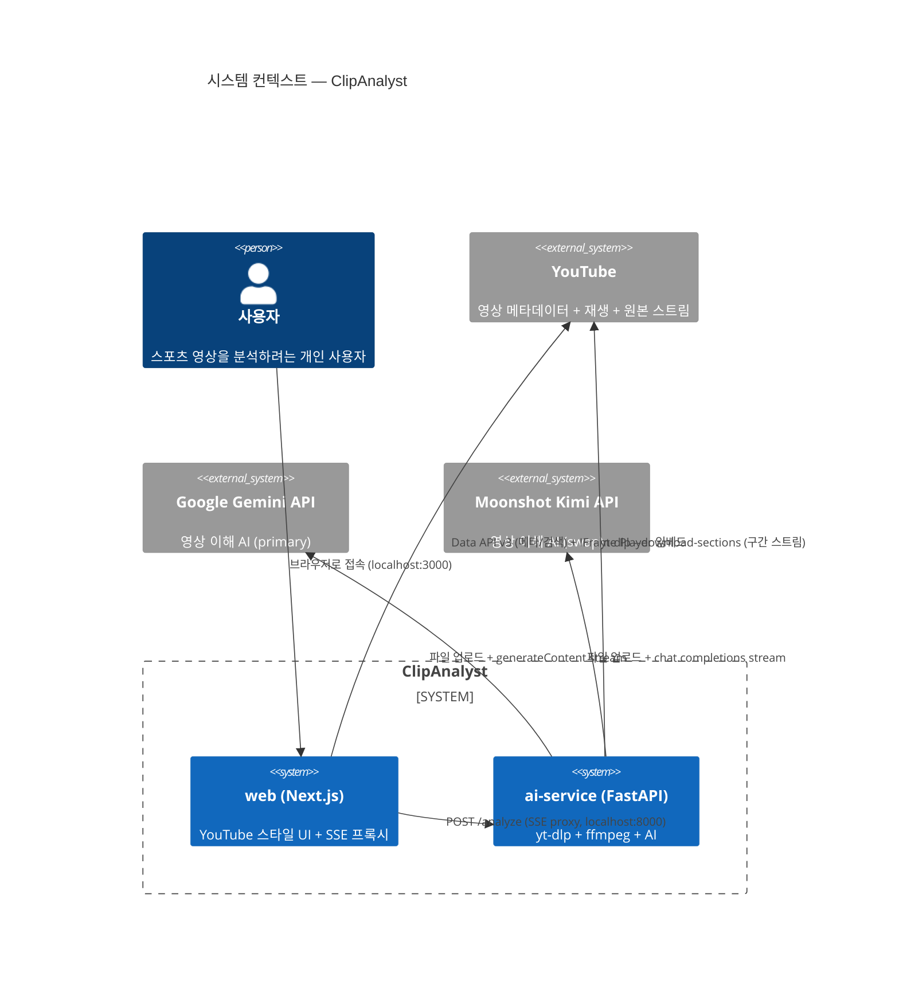
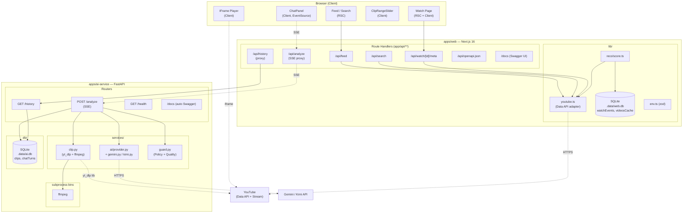
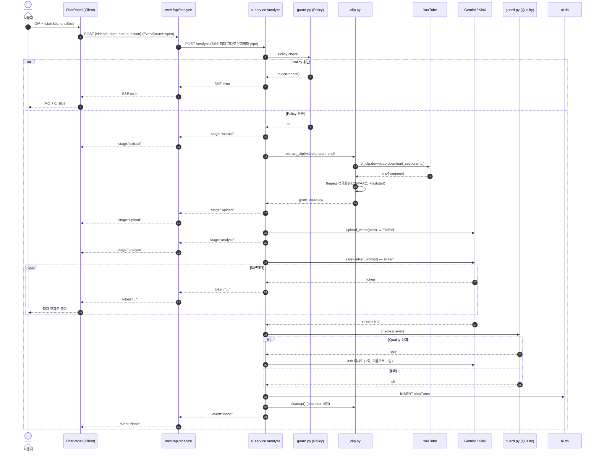
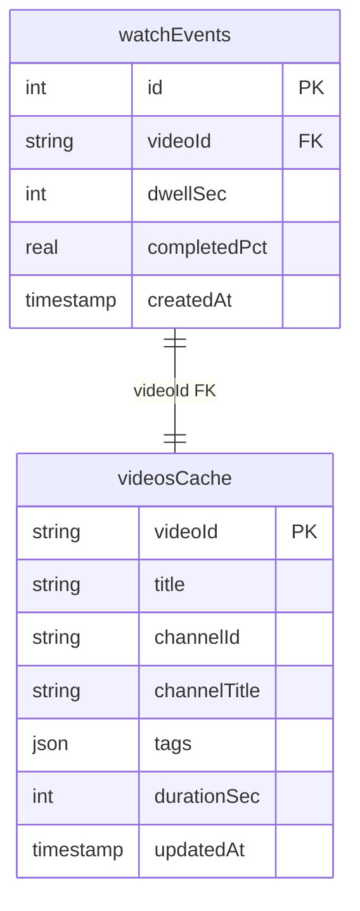
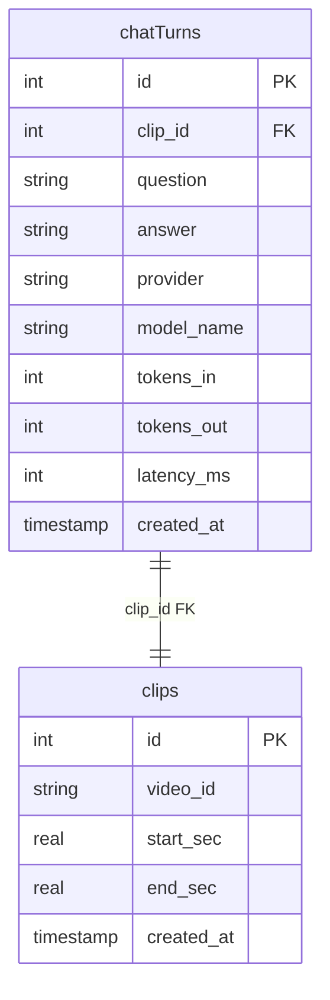
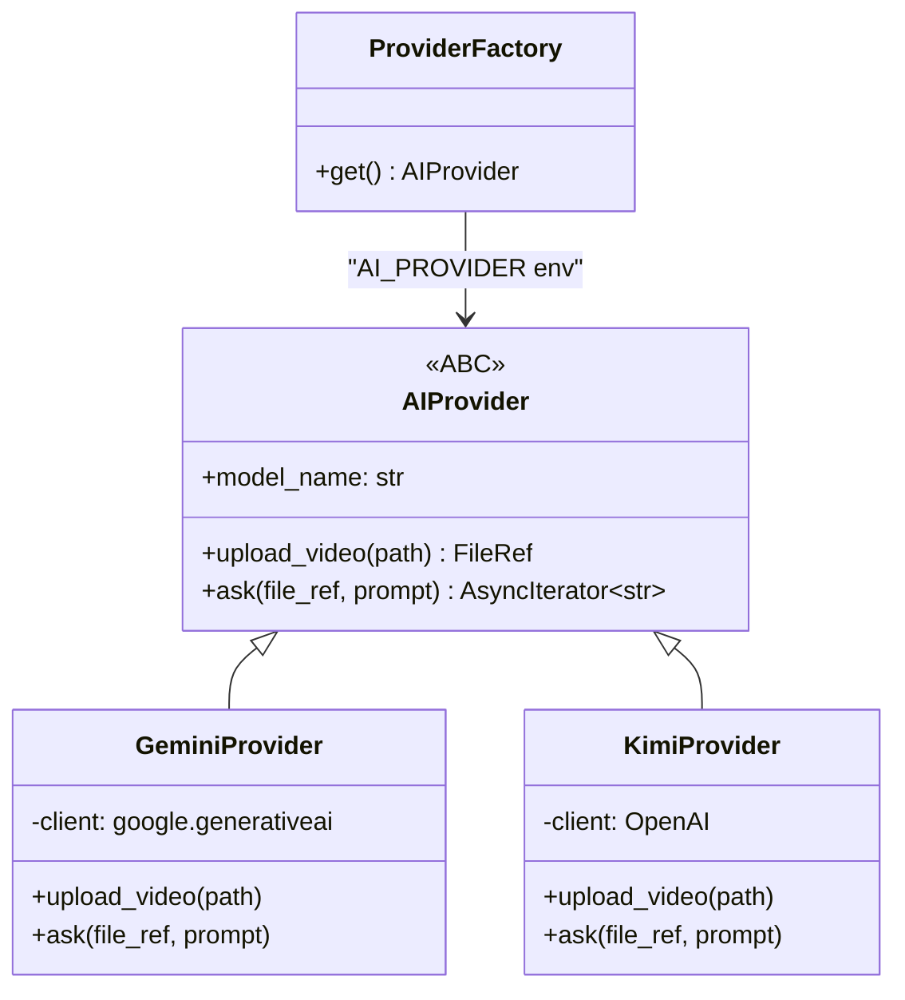
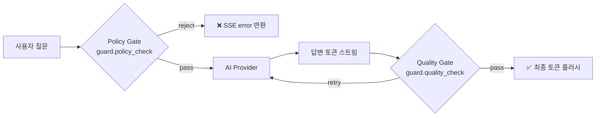
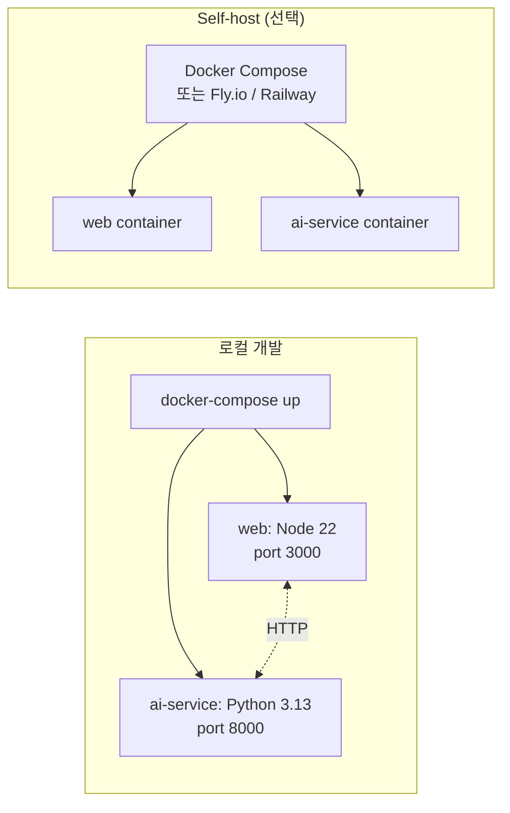

# 서비스 구조도 (Architecture)

**프로젝트**: ClipAnalyst
**작성일**: 2026-04-24 (v0.2 — MSA 분리 반영)
**대상 독자**: 개발자, 리뷰어, 포트폴리오 열람자

---

## 1. 설계 원칙

1. **언어별 적재적소의 서비스 분리 (MSA)**. UI는 React/Next.js, 영상·AI 파이프라인은 Python/FastAPI. 각 서비스는 자기 책임에 맞는 기술스택을 사용.
2. **경계가 명확한 두 서비스**. 서비스 간 통신은 HTTP + SSE 로만. 공유 DB 없음 (bounded context).
3. **외부 의존성은 모두 어댑터 뒤로**. YouTube Data API / Gemini / Kimi / yt-dlp / ffmpeg 모두 도메인 모듈로 격리하여 교체 가능.
4. **보안은 서버에서만**. API 키는 각 서비스 `.env`에서만 읽고, 클라이언트로 전달하지 않음. 영상 다운로드·AI 업로드는 모두 ai-service 내부.
5. **Fail loud, fail readable**. 바이너리(ffmpeg) 누락, API 키 누락 등 환경 문제는 boot-time에 사람이 읽을 수 있는 에러로 중단.

---

## 2. 시스템 컨텍스트 (C4 Level 1)

사용자-시스템-외부 의존 관계 최상위 뷰.



---

## 3. 컴포넌트 다이어그램 (C4 Level 2)

두 컨테이너 내부 구조.



### 3.1 각 모듈 단일 책임 (SRP)

#### apps/web (Next.js / TypeScript)

| 모듈 | 단일 책임 | 의존성 | 교체 가능성 |
|---|---|---|---|
| `lib/youtube.ts` | YouTube Data API v3 호출, 메타 정규화 | `googleapis` | 다른 영상 플랫폼 API |
| `lib/reco/score.ts` | 로컬 이력 기반 영상 추천 스코어링 | `lib/db`, `lib/youtube` | 외부 추천엔진 API |
| `lib/db/*` | Drizzle + SQLite (web 전용 DB) | `drizzle-orm`, `better-sqlite3` | Postgres로 client 교체 |
| `lib/env.ts` | 웹 환경변수 검증 | `zod` | — |
| `lib/openapi.ts` | 웹 쪽 OpenAPI spec 상수 | — | — |

#### apps/ai-service (FastAPI / Python)

| 모듈 | 단일 책임 | 의존성 | 교체 가능성 |
|---|---|---|---|
| `services/clip.py` | 원본 영상에서 구간 mp4 생성 | `yt_dlp`(library), ffmpeg(subprocess) | 다른 영상 다운로더 |
| `services/ai/provider.py` | AI 공급자 공통 ABC | — | — |
| `services/ai/gemini.py` | Gemini 3.1 Pro 어댑터 | `google-generativeai` | swap target |
| `services/ai/kimi.py` | Moonshot Kimi 어댑터 | `openai` (Moonshot baseURL) | swap target |
| `services/guard.py` | Policy(입력) + Quality(출력) 검사 | 경량 휴리스틱 | LLM-based guard |
| `db/models.py` | SQLAlchemy 2.x 모델 | `sqlalchemy`, aiosqlite | Postgres로 URL 교체 |
| `core/config.py` | `.env` 검증 (pydantic-settings) | `pydantic-settings` | — |
| `schemas.py` | FastAPI 요청/응답 Pydantic 모델 | `pydantic` | — |

---

## 4. 시퀀스 — "클립 분석" 플로우 (핵심 시나리오)



### 4.1 단계별 예상 지연시간

| 스테이지 | p50 | p95 | 설명 |
|---|---|---|---|
| Policy check | < 10ms | 50ms | 로컬 휴리스틱 |
| web → ai-service 홉 | < 5ms | 20ms | 같은 네트워크 |
| yt_dlp download (10초 클립) | 3s | 8s | 네트워크 의존. Python lib 직접 호출 (no subprocess spawn) |
| ffmpeg 정규화 | 1s | 3s | CPU 의존 |
| AI upload | 1s | 4s | 파일 크기 의존 |
| AI 첫 토큰 | 2s | 6s | 모델/큐 상태 의존 |
| **첫 토큰 누적** | **~7s** | **~21s** | NFR-PERF-01 목표 p95 ≤ 20s (MSA 홉 ~1s 추가 여유) |
| 스트리밍 완료 (~500 토큰) | 5s | 15s | 답변 길이 의존 |

---

## 5. 데이터 모델 (컨테이너별 독립 ERD)

### 5.1 apps/web — `.data/web.db` (Drizzle / SQLite)



### 5.2 apps/ai-service — `.data/ai.db` (SQLAlchemy / SQLite)



두 DB는 **완전 독립**. `videoId`만 조인 키 역할을 하지만 FK는 각자 DB 안에서만 유효.

---

## 6. AI Provider 추상화 (Python)



- `.env`의 `AI_PROVIDER`(`gemini` | `kimi`)로 런타임 선택.
- `FileRef` dataclass: `{ id: str, uri: str | None, mime_type: str }`.
- 공급자별 API 차이 전부 구현체 내부에 캡슐화.

---

## 7. Policy / Quality Gate 설계 (Python)



### 7.1 Policy Gate (입력, M5)

| 검사 | 방법 | 실패 응답 |
|---|---|---|
| 비속어/혐오 | 한/영 블록리스트 매칭 | "부적절한 표현이 감지되었습니다" |
| 프롬프트 인젝션 (`ignore previous`, `system:` 등) | 정규식 감지 | "허용되지 않는 지시문입니다" |
| 스포츠 맥락 이탈 | 영상 카테고리 + 질문 키워드 스코어링 | "스포츠 관련 질문만 지원합니다" |
| 길이 제한 | ≤ 500자 | "질문이 너무 깁니다" |

### 7.2 Quality Gate (출력, M5 P2)

| 검사 | 방법 | 실패 시 |
|---|---|---|
| 최소 길이 | `len(answer) > 50` | 재시도 1회 |
| 거절 응답 탐지 | "I can't help", "죄송하지만" 등 | 프롬프트 재강화 후 재시도 |
| 질문 키워드 반영 | 질문의 명사 ≥1개 답변 포함 | 로그 플래그만 |

---

## 8. 환경변수 관리 (per-service)

```
apps/web/.env.local
├─ YT_API_KEY           # YouTube Data API v3
├─ YT_REGION=KR         # 트렌딩 지역
└─ AI_SERVICE_URL=http://localhost:8000

apps/ai-service/.env
├─ AI_PROVIDER=gemini
├─ GEMINI_API_KEY       # Gemini 3.1 Pro
├─ MOONSHOT_API_KEY     # (optional) Kimi K2.6
└─ DB_URL=sqlite+aiosqlite:///.data/ai.db
```

검증:
- web: `lib/env.ts`의 zod schema.
- ai-service: `core/config.py`의 pydantic-settings.

---

## 9. 빌드·배포 (docker-compose)



- `docker-compose.yml` 루트에 1개 파일. 두 서비스는 dev 네트워크로 통신.
- 로컬 dev는 `npm run dev`(apps/web) + `uv run fastapi dev`(apps/ai-service) 병렬 실행도 가능. (Docker 의존 없이 빠른 반복)
- **CI** (후속): lint/typecheck/test 각 서비스별 병렬 게이트.

---

## 10. 설계 확장 경로 (Future Work)

| 시나리오 | 변경 포인트 | 영향 서비스 |
|---|---|---|
| 멀티유저 SaaS | 인증 서비스 추가 (web에 Auth.js 또는 별도 auth-service), users 테이블 | web + ai-service 둘 다 JWT 검증 |
| Postgres 전환 | 각 서비스 DB URL만 변경 | 개별적 |
| 클립 파이프라인 분산 | ai-service 내 Celery/RQ 워커 추가, Redis 큐 | ai-service |
| 관측성 강화 | OpenTelemetry 양쪽 모두 | 전 서비스 |
| 멀티-provider A/B | `ProviderFactory`에 ratio-based 라우팅 | ai-service |

---

## 11. 아키텍처 결정 기록 (ADR 요약)

| ADR | 결정 | 이유 |
|---|---|---|
| ADR-001 | Next.js 16 App Router for web | RSC 스트리밍 + 파일 라우팅 + 유저 TS/React 강점 |
| ADR-002 | Gemini primary, Kimi swap | Gemini 영상 이해 성숙도 높음, 공급자 비교 실험 가능 |
| ADR-003 | yt-dlp `--download-sections` (파이썬 lib 직접 호출) | 전체 다운로드 대비 10x+ 빠름, callback progress 가능 |
| ADR-004 | SQLite, 서비스별 분리 DB | 제로-설정, 경계 명확 (web→watch, ai→analysis), Postgres 전환 경로 10분 |
| ADR-005 | Auth 생략 (MVP) | localhost 단일 사용자 전제, 후속에 Auth.js 추가 가능 |
| ADR-006 | Policy/Quality Gate 별도 모듈 | 공급자 독립적 안전망, LLM-based guard로 업그레이드 여지 |
| ADR-007 | **MSA 분리 (web + ai-service)** — 2026-04-24 | **(a) yt-dlp가 Python native 라이브러리, (b) Next.js 16 Turbopack dev OOM 경험, (c) 포폴-grade 아키텍처에 적합 (예시와 동형 구조).** 가벼운 UI는 Next.js, 무거운 video/AI는 FastAPI. |
| ADR-008 | uv for Python 패키지 관리 | 2026 de facto 표준. pip 대비 10–100x 설치 속도, 단일 툴로 venv/lockfile/run 전부. |
